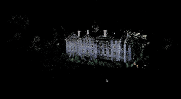

# Structure from Motion

This is a simple implementation of the Structure from Motion (SfM) algorithm using OpenCV in C++. The following steps are used in the algorithm:

1. Feature detection and matching using AKAZE
2. Essential matrix estimation
3. Camera pose estimation
4. Triangulation
5. Bundle adjustment (yet to be implemented)

The dataset used in this implementation is the South Building dataset from COLMAP. The dataset can be found at [COLMAP Datasets](https://colmap.github.io/datasets.html).
The camera intrinsic parameters are provided with the dataset.

The reconstructed point cloud is visualized using the  Open3D library in Python. 

## Installation

1. Clone the repository
2. Download and Unzip the dataset `south-building.zip` in the same directory. I have used a subset of the dataset.
3. Run the following commands (Don't forget to add "/" at the end of the path): 

    ```sh
    mkdir build
    cd build
    cmake ..
    make
    ./sfm "path_to_dataset/"
    ```
  
4. Run `pcd_vis.py` to visualize the point cloud

## Results

The following gif shows the point cloud generated from the dataset:



## References

1. Most of the code is taken from the SfM implementation by nghiaho12. The original code can be found at [nghiaho12/SFM_example](https://github.com/nghiaho12/SFM_example/tree/master).
2. The dataset is taken from the COLMAP dataset. The original dataset can be found at [COLMAP Datasets](https://colmap.github.io/datasets.html).

